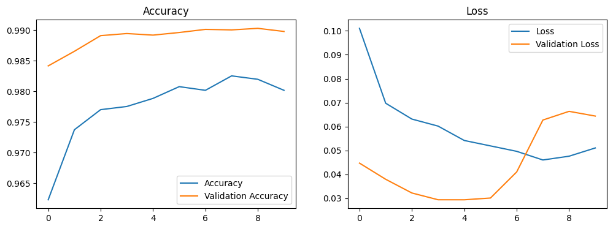

# Dog and Cat Image Classifier  
**AI Intern Assignment at Golden Owl**

## Overview
This project is aimed at classifying dog and cat images using deep learning models. It demonstrates the application of pre-trained models for image classification. The solution utilizes VGG16 but can be easily adapted to lighter models such as MobileNet V3, Inception V3, or VGG19.

## Requirements
To set up and run this project, you need to install the following dependencies:

```bash
pip install -r requirements.txt
```

## Dataset

The dataset used in this project is the Microsoft Cats vs. Dogs Dataset, available on Kaggle. You can download it from the following link:

[Microsoft Cats vs. Dogs Dataset](https://www.kaggle.com/datasets/shaunthesheep/microsoft-catsvsdogs-dataset)

To download the dataset from Kaggle, you must set up the Kaggle API. Follow these steps:

- Create a Kaggle account (if you don’t have one).
- Obtain your Kaggle username and API key from Kaggle Account Settings.
- Set the environment variables for Kaggle API access:
```python
import os

os.environ['KAGGLE_USERNAME'] = "your_kaggle_username"
os.environ['KAGGLE_KEY'] = "your_kaggle_api_key"
```
- Download the dataset
```bash
kaggle datasets download -d shaunthesheep/microsoft-catsvsdogs-dataset
```

## Training the Model
The model is trained using the source.ipynb Jupyter notebook. It leverages the VGG16 model for image classification, but you can replace it with other models such as:

- MobileNet V3
- Inception V3
- VGG19

You can experiment with different models depending on your performance and resource requirements.


## Running the Demo
Because the model in use is too large to upload to Github, please download it from the link: [Keras model](https://drive.google.com/file/d/1cTGYfs87G74Z3dithZ885hkstuaHllJW/view?usp=sharing)

Once the model is trained, you can run the demo app with the following command:
```bash
python app.py
```
